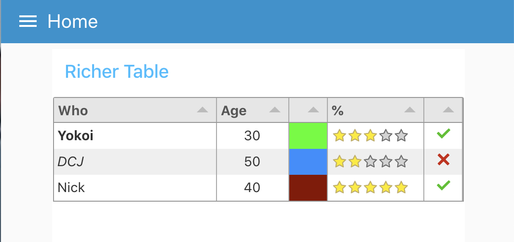

node-red-ui-node-table
======================

A Node-RED UI widget node which displays data as a table.

## Install

Either use the Editor - Menu - Manage Palette - Install option, or run the following command in your Node-RED user directory (typically `~/.node-red`) after installing Node-RED-dashboard.

        npm i node-red-ui-node-table

## Usage

This table node expects `msg.payload` to contain an array of data, one object per row.
Each data row object should have the same set of keys because the keys in the object are used as the column names.

Both examples can be imported from the Node-RED Editor - Menu - Import - Examples

### Simple Table

With no configuration the node will try to create a table with equally spaced columns of simple text for each row provided, using the keys as column titles.


### Richer Table

The columns can be configured manually. If so then only the `msg.payload` properties defined will be displayed. You can then also define the Title, Width, Alignment and Format of the column.



 - **Title**: Text for the column title (or blank).
 - **Width**: Either a number of pixels or percentage of the overall table width. e.g. 150 or 20%. Leave blank for automatic, equally spaced to fill the available space.
 - **Align**: Column alignment, left, centre or right.
 - **Format**: Formatting of the input.
   - **Plain Text** - Simple text values.
   - **HTML** - Rich html to allow text Formatting - *NOTE*: this is raw un-sanitised HTML.
   - **Link** - URL link to a web page.
   - **Image** - Source (src) URL of an image to display.
   - **Progress** - a progress bar from 0 to 100.
   - **Traffic** - Red/Amber/Green indicator light set by numbers in the range 0-33-67-100.
   - **Color** - HTML color name, or hex value (#rrggbb) to fill the cell.
   - **Tick/Cross** - Tick or Cross symbol, boolean true/false, numeric 1/0 or text "1"/"0".
   - **Stars** - Number of stars - numeric 0 to 5.
   - **Row Number** - Current row number.


### Example data

```
[
    {
        "Name": "Kazuhito Yokoi",
        "Age": "35",
        "Favourite Color": "red",
        "Date Of Birth": "12/09/1983"
    },
    {
        "Name": "Oli Bob",
        "Age": "12",
        "Favourite Color": "cyan",
        "Date Of Birth": "12/08/2017"
    }
]
```
